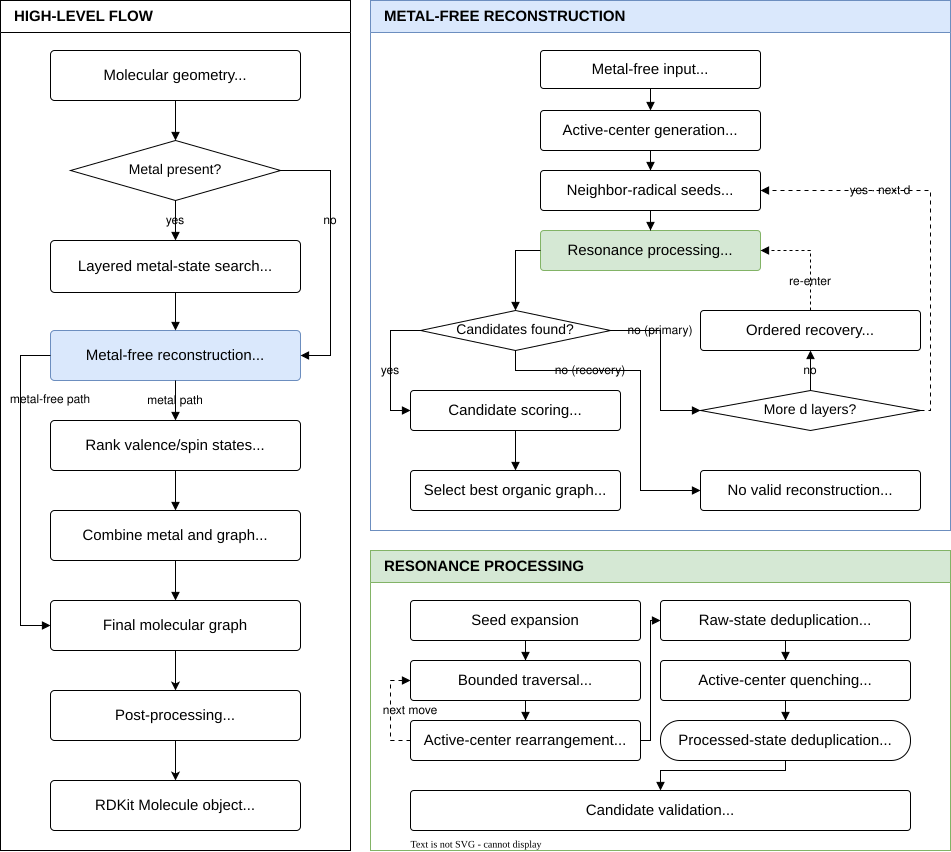
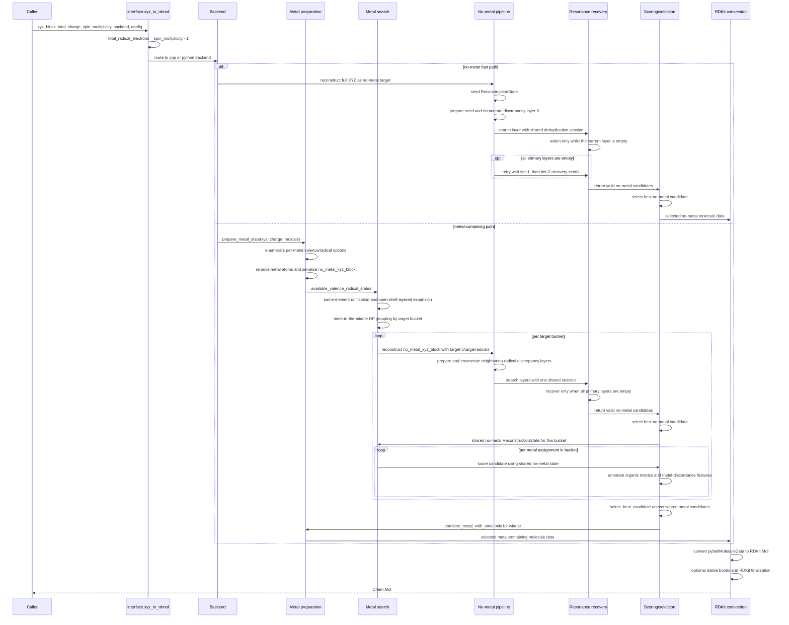

# MolGR Algorithm Architecture

[English](ALGORITHM_ARCHITECTURE.md) | [中文](ALGORITHM_ARCHITECTURE.zh-CN.md)

This document describes the current MolGR algorithm architecture as implemented
today. It covers the public `xyz_to_rdmol(...)` entrypoint in
[`src/molgr/interface.py`](../../src/molgr/interface.py), the Python fallback semantic reference, and the C++
`_core` acceleration backend.

Current status:

- the default backend is `backend="cpp"`
- the public API is still unified at `xyz_to_rdmol(...)`
- the Python fallback is the semantic reference
- the C++ backend mirrors the same algorithmic layering and accepts runtime
  `MolGRConfig`
- both backends return RDKit `Chem.Mol` after a backend-specific conversion step
- metal-containing inputs use a shared two-stage architecture:
  reconstruct the metal-free organic core first, then select metal states, and
  only reinsert metals for the final winner

## Architecture Overview

Figure 1 is the compact, publication-oriented overview of the algorithm. It
keeps node labels abstract and separates the end-to-end flow from the
metal-free reconstruction and resonance-processing details. The editable source
is [`ALGORITHM_ARCHITECTURE.drawio`](ALGORITHM_ARCHITECTURE.drawio).



*Figure 1. MolGR end-to-end reconstruction architecture.*

## Terminology

- `discordance` means the features and accumulated penalty by which a candidate
  molecular graph departs from a natural, internally harmonic electronic
  structure. In Chinese it is uniformly translated as “失谐”, not the generic
  “不一致”.
- `harmonicity` means the overall structural coordination or harmony. The
  current selection flow prioritizes lower discordance rather than directly
  maximizing harmonicity.

## Unified Architecture

The current algorithm can be read as seven layers:

1. API normalization
   - `xyz_to_rdmol(xyz_block, total_charge, spin_multiplicity, backend, config)`
   - calculate the total electron count from the XYZ elements and `total_charge`,
     then reject multiplicities with impossible parity or magnitude
   - normalize `spin_multiplicity` into `total_radical_electrons = spin_multiplicity - 1`
   - resolve config and route to Python or C++

2. Backend execution boundary
   - Python: `molgr.fallback.pipeline.reconstruct_with_metals.xyz2omol(...)`
   - C++: `molgr._core.pipeline.reconstruct_with_metals.xyz2omol(...)`
   - the C++ binding releases the GIL and converts Python config into C++ config

3. Metal-aware orchestration
   - read XYZ
   - enumerate per-metal `(valence, radical_num)` candidates
   - strip metals and build `no_metal_xyz_block`
   - compress metal combinations into no-metal target buckets:
     `(no_metal_charge_target, no_metal_radical_target)`

4. Metal-free reconstruction
   - seed a `ReconstructionState`
   - run deterministic preparation up to neighboring-radical handling
   - enumerate complete local resolutions by exact charge-separation action count
   - search bond-order-only seeds first, then progressively widen to charge-separated seeds

5. Resonance recovery
   - traverse each discrepancy layer using the configured resonance depth and policy
   - normalize each raw resonance once through the full `process_resonance` pipeline
   - share raw-state, traversal-label, and processed-state deduplication across layers
   - stop after the first layer that produces valid candidates
   - keep only candidates that match the charge/radical target
   - only if the pool is empty, retry with deformed-pi recovery and then
     last-resort bond-break recovery
   - choose the best no-metal candidate by organic topology first, then force-field score

6. Metal candidate scoring and selection
   - each no-metal target bucket is reconstructed once and shared by all metal assignments in that bucket
   - each metal candidate inherits the shared organic-core force-field score
   - selection compares structural metal discordance, organic electronic-state
     metrics, organic-core force-field score, then `combination_index`
   - only the final winner materializes metal reinsertion

7. RDKit output finalization
   - Python backend: `pybel_to_rdmol(...)`
   - C++ backend: `mol_data_to_rdkit(...)`
   - optional `make_dative_bond(...)`
   - final RDKit aromaticity, stereo, chirality, and CIP assignment

Key state objects:

- `ReconstructionState`: metal-free reconstruction state with molecule, targets, phase history, and score caches
- `MetalPreparationState`: stripped-metal input plus per-metal electronic-state options
- `MetalCandidateState`: one metal assignment and its induced no-metal target bucket, optionally bound to a shared `ReconstructionState`
- `MolGRConfig`: unified runtime config for resonance, metal scoring, metal radical inference, and C++ backend switches; force-field scoring is fixed to UFF

The candidate score in Figure 1 is a single organic-core UFF score. It is
evaluated once for each validated candidate and reused by the no-metal selection
step. Metal-state selection adds discordance and electronic-consistency criteria;
it does not introduce a second independent metal score.

## Implementation Views

The following views expose backend routing and call order. They complement the
publication-oriented overview and should not be read as additional algorithm
stages.

### Call Graph

```mermaid
flowchart TD
    API["xyz_to_rdmol<br/>src/molgr/interface.py"] --> ValidateSpin["validate electron count and spin multiplicity"]
    ValidateSpin --> Normalize["total_radical_electrons = spin_multiplicity - 1"]
    Normalize --> Backend{"backend"}

    Backend -->|"cpp"| CppEntry["_core.pipeline.reconstruct_with_metals.xyz2omol<br/>pybind: releases GIL"]
    Backend -->|"python"| PyEntry["fallback.xyz2omol"]

    CppEntry --> CppFast{"XYZ definitely metal-free?"}
    CppFast -->|"yes"| CppNoMetal["C++ XyzToOmolNoMetalState"]
    CppFast -->|"no"| CppMetal["C++ Xyz2OmolMolData metal-aware flow"]

    PyEntry --> PyMetal["Python xyz2omol_state metal-aware flow"]

    CppMetal --> Prep["prepare_metal_state / PrepareMetalState"]
    PyMetal --> Prep
    Prep --> MetalOptions["enumerate metal valence/radical states"]
    Prep --> Strip["remove metals -> no_metal_xyz_block"]

    MetalOptions --> SearchGroups["build metal state search groups<br/>same-element unification + open-shell layers"]
    SearchGroups --> DP["group candidates by target via meet-in-the-middle DP"]
    DP --> Buckets["target buckets:<br/>(no_metal_charge_target, no_metal_radical_target)"]

    Buckets --> NoMetal["xyz_to_omol_no_metal_state / XyzToOmolNoMetalState<br/>run once per target bucket"]
    CppNoMetal --> Seed["seed no-metal ReconstructionState"]
    NoMetal --> Seed
    Seed --> Prepare["prepare no-metal seed:<br/>connectivity and deterministic cleanup"]
    Prepare --> CandidateEnum["enumerate exact discrepancy layer:<br/>0, then 1, ..."]
    CandidateEnum --> SeedPool["build layer seed pool:<br/>raw + electronic-state variants"]
    SeedPool --> Resonance["search with shared session"]
    Resonance --> Walk["limited-discrepancy radical resonance traversal"]
    Walk --> Process["dual normalization + global dedupe + validate"]
    Process -->|"empty and layers remain"| CandidateEnum
    Process -->|"all layers empty"| Recovery1["tier 1: recover deformed pi bonds"]
    Recovery1 -->|"empty"| Recovery2["tier 2: break bonds as last resort"]
    Process --> NoMetalSelect["select no-metal candidate"]
    Recovery1 --> NoMetalSelect
    Recovery2 --> NoMetalSelect

    NoMetalSelect --> ScoreMetal["score metal candidates with shared no-metal state"]
    ScoreMetal --> MetalSelect["select_best_candidate"]
    MetalSelect --> Reinsert["combine_metal_with_omol only for winner"]

    Reinsert --> CppMolData["C++ MoleculeData"]
    CppNoMetal --> CppMolData
    PyMetal --> Pybel["pybel.Molecule"]

    CppMolData --> RdkitCpp["mol_data_to_rdkit"]
    Pybel --> RdkitPy["pybel_to_rdmol"]
    RdkitCpp --> Post["make_dative_bond + RDKit stereo/aromaticity finalization"]
    RdkitPy --> Post
    Post --> Out["Chem.Mol"]
```



### Data-Flow Sequence Diagram



## Algorithm Details

### Metal-Free Preparation, Seed Enumeration, And Recovery

The deterministic metal-free preparation is aligned between
[`src/molgr/fallback/utils/no_metals/preparation.py`](../../src/molgr/fallback/utils/no_metals/preparation.py)
and the corresponding C++
implementation:

1. `make_connections`
2. `pre_clean`
3. `fresh_omol_charge_radical_initial`
4. initialize the residual charge budget
5. run the eliminate/clean sequence for NNN, high positive centers, ambiguous CN,
   carboxyl, and carbene-adjacent cases

The deterministic preparation stops before neighboring-radical resolution.
`enumerate_neighbor_radical_seeds(...)` then enumerates complete local action
sequences. Each adjacent pair may increase bond order or become either
orientation of charge separation. Disjoint and overlapping pairs can therefore
produce mixed strategies rather than one global branch choice.

The production pipeline calls `enumerate_neighbor_radical_seeds(...)` with an
exact discrepancy budget. Layer zero contains bond-order-only resolutions;
later layers contain resolutions with one or more charge-separation actions.
`build_resonance_seed_pool(...)` keeps each layer's original branch states and adds
distinct states produced by carbene-radical relocation. Initialization is the only
phase that infers electronic labels globally; every later transformation updates its
affected atoms explicitly.

All primary layers reuse one resonance search session. Raw resonance states,
Pareto traversal labels, and processed states discovered by an earlier layer are
not recomputed. Search stops at the first layer with a valid candidate. There is
no separate direct-candidate path after this point.

### Resonance Recovery

Resonance search consumes one discrepancy layer at a time while deduplicating
globally across the shared session.

Current behavior:

- build a resonance state key and bond index map
- enumerate one-step radical resonance moves
- choose traversal ordering from config:
  - `uff_lite_gain`
  - `input_order`
- by default, use limited-discrepancy traversal
- deduplicate raw states across seeds
- normalize each raw state once with full `process_resonance`, then deduplicate
  processed states globally
- keep only candidates that satisfy `validate_omol(...)`
- if none survive, generate tier-1 deformed-pi recovery seeds and search again
- if that is still empty, generate tier-2 bond-break recovery seeds and search
  one final time
- select the best no-metal candidate by:
  1. higher aromatic stability, then more aromatic atoms
  2. larger charge-adjusted conjugated topology
  3. fewer excess radical labels
  4. lower force-field score

### Metal Search and Selection

The metal-aware pipeline does not enumerate the full Cartesian product and then
score everything. It compresses the search space first.

#### Metal-state enumeration

For each atom that OpenBabel classifies as a metal:

- fetch candidate valences from `METAL_VALENCE_AVAILABLE_PRIOR` and `METAL_VALENCE_AVAILABLE_MINOR`
- infer plausible radical counts from local coordination environment
- build `MetalAtomPosition(idx, symbol, element_idx, valence, radical_num, xyz)`
- remove the metal atom from the organic-core reconstruction path

`metal_radical_inference` is a ligand-field heuristic rather than a single-spin
lookup:

- first estimate the post-oxidation shell occupation from the element's nominal
  `f/d/s/p` electrons and the candidate valence; d-block metals may relax
  residual `s/p` electrons into the d shell up to `d10`
- collect donors using an element-sensitive covalent-radius cutoff capped by
  the global coordination cutoff, rather than accepting every atom inside one
  fixed sphere
- assign donor weights following the coarse spectrochemical ordering (halides
  weak; O/S weak-to-intermediate; N intermediate; neutral phosphine and carbon
  donors strong), distance-average them, and apply a geometry correction
- classify scores below `weak_field_threshold - field_ambiguity_margin` as
  weak and scores above `strong_field_threshold + field_ambiguity_margin` as
  strong; the interval between them is explicitly `ambiguous`
- weak-field states keep the high-spin end, strong-field states keep the
  low-spin end, and ambiguous states keep both; the side of the interval nearest
  the score determines the preferred-first order
- square-planar `d8/d7/d9` retains its geometry-specific low-spin rule

Metal-localized unpaired electrons consume the requested radical budget before
the no-metal target is built. The organic target is
`max(0, input radicals - metal-localized radicals)`: excess local metal spins
may represent antiferromagnetically coupled centers and therefore do not reject
the state or produce a negative organic target. This lets ambiguous ligand-field
branches reach reconstruction while preserving the ordinary radical budget when
it is sufficient.

#### Search-space compression

The current pipeline compresses metal combinations in three steps:

- same-element multimetal unification
- open-shell layered search
- meet-in-the-middle DP over partial assignments

The DP result is grouped by:

```text
(no_metal_charge_target, no_metal_radical_target)
```

So different metal assignments that induce the same metal-free target only pay
for one metal-free reconstruction.

#### Metal candidate scoring

Each `MetalCandidateState` is scored after attaching a shared
`ReconstructionState`. Candidate selection uses:

- the shared organic-core force-field score
- metal-discordance features derived from organic electronic-state metrics:
  - aromatic atoms and rings
    - aromatic rings are first marked by OpenBabel and grouped into fused
      systems when they share a bond; multi-ring systems are accepted or
      rejected as a whole instead of applying an independent `4n+2` test to
      each SSSR ring
    - if the absolute value of the formal-charge sum over the unique atoms in
      a ring system is at least 4, the whole system is rejected
    - this prevents heavily charge-separated rings from being treated as
      aromatic only because they formally satisfy a `4n+2` electron count
    - aromatic-ring and aromatic-stability deficits are retained as diagnostic
      metadata, but they do not contribute to hard discordance
  - conjugated atoms and bonds
  - maximum conjugated component size
  - charge localization penalty
    - positive and negative atom penalties carry opposite signs only within a
      directly bonded charged-atom group; neutral atoms do not bridge distant
      charges in a large ligand component
    - this preserves local zwitterionic/resonance compensation without
      treating remote charges as one delocalized cancellation unit
  - radical localization penalty
- local metal-coordination discordance checks based on inner-sphere visibility,
  formal charge signs, visible diradicals, and charge-balance exceptions

#### Metal candidate discordance features

Discordance features identify chemically incoherent organic-metal combinations
induced by an incorrect metal-valence candidate. The algorithm does not use
discordance features to adjust the current candidate's metal valence, because
the metal search has already enumerated the available valence candidates. The
correct-valence candidate should avoid these discordance features naturally.

Typical discordance structures to record:

1. Inner-sphere visible diradical atom
   - the atom is inside the metal coordination radius, defined as
     `metal_access_radius_scale * (metal covalent radius + atom covalent radius) + metal_coordination_extra_tolerance_angstrom`;
     defaults are `metal_access_radius_scale=1.0` and extra tolerance `0.75 Å`.
     The inner-sphere check and dative-bond completion call the same cutoff
     helper and configuration; there is no additional `3.2 Å` upper bound.
   - RDKit post-processing dative-bond completion uses the same
     radius-scale and `metal_coordination_extra_tolerance_angstrom` distance
     criterion as the inner-sphere check.
   - π dative-bond completion additionally requires the two ligand atoms to have
     similar metal distances; the absolute distance difference is limited by
     `pi_dative_distance_difference_tolerance_angstrom`, default `0.10 Å`.
   - the coordination path from the metal center to the atom is visible and not
     blocked by other atoms; blocker radii are
     `metal_access_radius_scale * blocker covalent radius + metal_access_clearance_angstrom`,
     and visibility is a second dimension separate from the inner/outer distance
     test
   - the atom appears as a diradical in the current candidate; diradical markers
     on `P/S/Cl/Br/I` are exempt because intermediate valence states for these
     elements often represent lone pairs instead
   - an isolated oxygen atom is the typical example
   - chemical meaning: this is usually not a plausible neutral diradical ligand,
     but an unrecognized inner-sphere `O^2-`-like coordination structure under
     the wrong valence candidate
   - selection role: mark local metal-coordination electronic discordance for
     the current candidate; do not modify that candidate's metal valence

2. Outer-sphere or invisible adjacent double charge
   - the organic part contains adjacent double negative charges or adjacent
     double positive charges
   - unless both charged sites are visible inner-sphere atoms, the pair is
     treated as discordant
   - visible inner-sphere atoms are not an unconditional exemption: adjacent
     same-sign carbon ions (`C-`/`C-` or `C+`/`C+`) still count as discordant
     even when both atoms are visible inner-sphere atoms; two visible
     inner-sphere same-sign carbon ions bridged by one conjugated double bond,
     such as `C-–C=C–C-` or `C+–C=C–C+`, also count as discordant
   - the same-sign adjacent charges look like a `pi` electron pair forcibly
     separated under the wrong metal-valence assumption, rather than a stable
     local coordination or delocalization pattern; adjacent inner-sphere
     or short-conjugated same-sign carbon ions (`C-`/`C-` or `C+`/`C+`) are
     common in organometallic `pi` coordination intermediates or the reverse
     charge-assignment form, and should not be treated as ordinary isolated
     coordinating charges
   - chemical meaning: the current candidate has pushed a two-electron
     metal-ligand-system assignment into the organic part, creating abnormal
     compensating charge separation
   - selection role: mark organic `pi` electron assignment discordance for the
     current candidate; do not modify that candidate's metal valence

3. Inner-sphere visible coordinating atom with repulsive formal charge
   - the atom is inside the metal coordination radius, using the same covalent
     radius sum plus additive tolerance definition
   - the coordination path from the metal center to the atom is visible and not
     blocked by other atoms
   - when the metal formal valence in the current candidate is nonzero, the atom
     has a nonzero formal charge with the same sign as that metal valence
   - when the metal formal valence in the current candidate is zero, a positive
     formal charge on the visible inner-sphere atom also counts as this
     discordance feature
   - local charge-cancellation exemption: if the atom formal charge plus the
     formal-charge sum over adjacent non-metal atoms is zero, this feature does
     not count as discordant
   - chemical meaning: a visible inner-sphere coordination site should provide
     electrostatic or donor support compatible with the metal valence; same-sign
     formal charge repels a nonzero metal-valence candidate, while a positive
     inner-sphere charge around a zero-valence metal leaves an electron-deficient
     coordination center in the organic inner sphere
   - selection role: mark inner-sphere coordination electrostatic discordance
     for the current candidate; do not modify that candidate's metal valence

4. Organic cation under an all-zero-valence metal assignment
   - if every metal in the current candidate has formal valence zero and the
     no-metal organic part contains any positively charged non-metal atom, the
     candidate receives one discordance count
   - the positive atom does not need to be inner-sphere or visible; this is a
     candidate-level global criterion
   - zwitterionic forms are exempt: if the organic part has total formal charge
     zero, or if the organic cation is unsaturated and its charge plus the
     formal-charge sum over its adjacent non-metal atoms is zero, this feature
     does not count as discordant
   - chemical meaning: when all metals are assigned zero valence, a remaining
     organic cation usually indicates that the candidate lacks a plausible
     metal-ligand charge-assignment source
   - selection role: mark global charge-assignment discordance between an
     all-zero-valence metal combination and an organic cation state

5. Unsaturated organic cation in a metal candidate
   - whenever the current candidate contains a metal, and the no-metal organic
     part contains an unsaturated positively charged non-metal atom, the
     candidate receives one discordance count regardless of metal valence sign
   - an unsaturated organic cation is a positively charged atom whose assigned
     outer-shell electron count, `outer_electrons - formal_charge +
     total_bond_order`, is below the closed-shell target (2 for H, 8 otherwise);
     bonded-atom degree is not compared with bond order, so a single triple bond
     on `O(v3)+` is not misclassified; this includes under-valent onium-like
     cations
   - zwitterionic forms are exempt: if the organic part has total formal charge
     zero, or if the unsaturated cation's charge plus the formal-charge sum over
     its adjacent non-metal atoms is zero, this feature does not count as
     discordant
   - chemical meaning: an under-saturated cation is a pseudo-cation center that
     can accept electron density from the metal; even a negative-valence metal
     can transfer charge into it
   - selection role: mark metal-organic electron-transfer discordance

6. Negative-valence metal without an explicit charge-balance source
   - each negative formal valence metal in the current candidate contributes
     `0.5` discordance by default
   - exception one: the no-metal structure contains an outer-sphere `H+`,
     meaning the positively charged hydrogen atom is outside the inner-sphere
     coordination radius of every current metal candidate; other outer-sphere
     organic cations no longer exempt a negative-valence metal
   - exception two: the current candidate also contains another positive-valence
     metal; this can provide metal-cation charge balance for the negative metal
     center
   - chemical meaning: isolated negative-valence metals are chemically unlikely
     for most candidates unless an explicit outer-sphere proton acid or a
     metal cation balances the charge
   - selection role: mark global charge-balance discordance for the current
     metal-valence candidate; do not remove the candidate directly

7. Charge-asymmetric constitutionally repeated components
   - disconnected organic components are grouped by an element-and-connectivity
     signature that deliberately ignores formal charge and bond order
   - a repeated component group contributes one discordance count when its
     members have different net formal charges
   - this identifies a candidate that breaks equivalent ligand fragments into
     discordant oxidation or reduction states

8. Reduced visible haptic carbon ring with a broken pi pattern
   - a specific five- or six-membered all-carbon ring must expose at least three
     ring carbons to the same metal through the inner-sphere visibility test
   - complete aromatic or Kekule pi patterns are not counted, including
     six-membered rings with three alternating double bonds and five-membered
     anionic rings with two non-adjacent double bonds
   - after those complete pi rings are excluded, each negatively charged carbon
     in the visible haptic ring contributes one discordance count
   - this captures a metal-valence candidate that reduces a haptic carbon-ring
     ligand and breaks its delocalized pi form; it is a ring-local structural
     discordance, not a global aromaticity reward

9. Strong coordination-geometry mismatch
    - square-planar Pd/Pt candidates at formal valence IV or higher contribute
      one discordance count
    - linear Ag/Au candidates at formal valence III or higher contribute one
      discordance count
    - the rule is intentionally restricted to these strong geometry/oxidation
      contradictions; other geometries remain diagnostic-neutral

Final selection keeps the feature layers explicit:

- first attach the shared no-metal state to every metal candidate and compute
  the organic-core force-field score
- `metal_discordance_structural_count` is the sum of structural features,
  including the fractional negative-metal penalty
- `metal_discordance_count` is the same structural total; aromatic deficits and
  metal-state list membership are not included
- compare `metal_discordance_count` first and keep only candidates with the
  lowest discordance score
- if multiple candidates tie, first prefer the smaller maximum-conjugated-component,
  conjugated-atom, and conjugated-bond deficits, in that order
- then prefer the candidate with the smaller aromatic-atom coverage deficit,
  followed by the smaller aromatic-ring deficit
- if those coverage metrics tie, prefer the smaller aromatic-stability deficit
- if those diagnostics also tie, prefer the smaller organic radical-localization
  penalty
- within candidates tied on every preceding field, compare each organic
  charge-localization penalty with the group minimum: only a difference greater
  than or equal to
  `metal_scoring.charge_localization_selection_margin` participates in
  selection; smaller differences are treated as tied and defer to the
  force-field score. The default margin is `0.3`
- only after the structural and electronic-state scores tie, compare the
  organic-core force-field score; the order of configured metal-state lists is
  not a chemical score
- if all chemical scores tie, use `combination_index` as a stable deterministic
  tie-breaker
- The recorded metal-candidate `selection_key` is ordered as:
  `(metal_discordance_count, max_conjugated_component_deficit,
  conjugated_atom_deficit, conjugated_bond_deficit, aromatic_atom_deficit,
  aromatic_ring_deficit, aromatic_stability_deficit,
  radical_localization_penalty, charge_localization_margin_exceeded,
  force_field_score, combination_index)`.
- selected candidates still record organic electronic-state metrics used to
  derive discordance, but the removed metal-environment scoring metrics no
  longer exist in the runtime metadata

## Implementation and Validation

### Extra C++ Optimizations

The C++ backend is the accelerated implementation of the Python fallback
semantics. The optimizations below may change scheduling, caching, and
thread-safe implementation details, but they must not change the candidate set,
candidate order, scoring keys, tie-breakers, or final selected molecule for the
same `MolGRConfig`.

1. Metal-free fast path
   - `XyzBlockIsDefinitelyMetalFree(...)` scans atom symbols in the XYZ block
   - confirmed metal-free inputs skip metal preparation and metal-state search

2. GIL release
   - the pybind entry releases the Python GIL around the C++ pipeline

3. Target-bucket parallelism
   - `enable_target_bucket_parallelism` is enabled by default
   - `target_bucket_parallel_threshold` defaults to `1`
   - `target_bucket_parallel_max_threads=None` means C++ automatically caps
     worker count by hardware concurrency, target-bucket count, and
     `cpp_backend.max_threads` when that global cap is set
   - independent no-metal target buckets can be reconstructed in parallel
   - bucket workers clone a shared no-metal XYZ seed molecule instead of
     re-parsing the same XYZ block

4. Parallel DP frontier construction
   - when target-bucket parallelism is enabled and both halves are non-empty,
     the C++ meet-in-the-middle search builds one frontier with `std::async`

5. Parallel candidate scoring
   - `enable_candidate_scoring_parallelism` is wired but disabled by default
   - when enabled and the candidate count crosses
     `candidate_score_parallel_threshold`, candidate scoring runs in parallel

6. Preheated no-metal score bundle
   - `ReconstructionState::PreheatScoreBundle(...)` prepares and caches:
     - force-field score key
     - organic-core force-field score
     - post-reinsertion base components
     - fixed UFF force-field metadata
   - bucket-shared no-metal states can reuse this bundle across many candidates
   - `enable_target_bucket_score_bundle_preheat` is enabled by default and can
     be disabled independently when debugging behavior differences

7. Global force-field evaluation LRU
   - `ForceFieldEvaluationCache` is a thread-safe LRU keyed by structure,
     for fixed UFF scoring

8. MolGR vendor UFF force field
   - C++ always uses MolGR's thread-safe `MolgrForceFieldUFF` vendor submodule
     for UFF scoring instead of OpenBabel's process-global force-field plugin.
   - This avoids the global `OBForceField::FindForceField("uff")`
     Setup/Energy lock while keeping the same fixed-UFF scoring policy as the
     Python fallback.
   - `enable_uff_atom_typing_cache` is an optional C++ acceleration and is
     disabled by default.

9. Thread-local reusable vendor UFF instances
   - each thread reuses force-field instances
   - exact and coarse setup keys guard against stale OpenBabel setup reuse

10. Copy-on-write OBMol state
    - `OmolStateMachine` stores `shared_ptr<OBMol>`
    - branches share state until mutation requires `EnsureUniqueMol()`

11. MolGR vendor XYZ seed perception
    - C++ XYZ seed parsing uses `molgr::utils::ReadXyzBlockToMol(...)` and
      `molgr::vendor::openbabel_threading::ConnectTheDotsAndPerceiveBondOrders(...)`.
    - This helper vendors the narrow OpenBabel bond-connectivity and
      bond-order perception logic needed by MolGR's XYZ seed path instead of
      calling `OBMol::ConnectTheDots()` and `OBMol::PerceiveBondOrders()`
      behind a process-wide lock.
    - Do not call the OpenBabel methods directly from C++ code; doing so
      serializes target-bucket workers and can hide behavior differences from
      the Python fallback.

12. Lightweight cross-language return type
    - the C++ backend returns `MoleculeData`, then Python converts to RDKit

13. Built-in timing instrumentation
    - `RunTimingReducer` records no-metal, resonance, metal enumeration, and
      force-field timing breakdowns for profiling

Implementation note:

- resonance-candidate parallelism was removed because scheduling overhead was
  higher than the benefit, so the current version no longer exposes C++ config
  fields for it
- `SearchResonanceCandidates(...)` still prepares resonance candidates serially

### C++/Python Parity Guardrails

The Python fallback is the semantic reference. The C++ backend may cache,
parallelize, precompute, or use thread-safe vendor submodules, but those changes
must preserve the same candidate set, candidate order, scoring keys, and final
selected molecule as the Python fallback for the same `MolGRConfig`.

Past backend divergences that must not be reintroduced:

1. SMARTS matching semantics
   - C++ SMARTS calls must go through `molgr::smarts::FindAll(...)`.
   - `FindAll(...)` intentionally mirrors `pybel.Smarts.findall()` by calling
     `OBSmartsPattern::Match(mol)` and returning `GetUMapList()`.
   - Direct `OBSmartsPattern::Match(...)`, `GetMapList()`, or lower-level
     OpenBabel match-list helpers should not be used outside the SMARTS helper.

2. Force-field setup state
   - OpenBabel UFF force-field instances are stateful and reuse setup data.
   - Both backends must track an exact setup key and OpenBabel's coarser setup
     key; when the exact key changes but the coarse key does not, the force
     field must be reset before `Setup(...)`.
   - Force-field cache clearing must also clear setup-state tracking.
   - Vendor UFF and atom-typing caches must keep the same reset behavior.

3. No-metal resonance selection
   - C++ must use the same one-pass full selection key as Python:
     `(-aromatic_atom_count, -aromatic_ring_count, -aromatic_stability,
     -adjusted_max_conjugated_component_size,
     -adjusted_conjugated_atom_count, -adjusted_conjugated_bond_count, score)`.
   - Do not reintroduce topology-first filtering that delays UFF scoring until
     after a partial key comparison; the intermediate candidate summaries must
     match Python, not only the final chemistry.

4. `clean_resonances_8`
   - C++ must match the Python condition. The rule is gated by the bond-order
     pattern only; extra atom-charge checks change behavior.
   - Aromatic perception resets must use the thread-safe OpenBabel helper.

5. Element constants in elimination rules
   - Keep numeric atomic-number lists aligned with Python constants.
   - Iodine is `53`; avoid hand-written drift such as accidentally using `56`.

6. Threading and C++-only accelerations
   - `enable_target_bucket_parallelism` and similar C++-only options may change
     scheduling and performance, but not result order, tie-breakers, or selected
     candidates.
   - Any optimization that can change candidate construction, filtering, score
     reuse, OpenBabel perception, or force-field setup must be guarded by parity
     tests before it is enabled.

7. C++ XYZ seed perception
   - C++ must not call `OBMol::ConnectTheDots()` or
     `OBMol::PerceiveBondOrders()` directly. The only allowed C++ XYZ seed
     entry is `ReadXyzBlockToMol(...)`, which uses the MolGR vendor helper.
   - Reintroducing a global perception lock around OpenBabel's native methods
     breaks target-bucket parallelism and makes the C++ backend a different
     implementation strategy rather than a straight Python fallback
     acceleration.

Focused validation for these boundaries:

```bash
uv run pytest \
  tests/test_cpp_python_metal_candidate_parity.py \
  tests/test_cpp_uff_atom_typing_cache.py \
  tests/test_force_field_scoring_policy.py \
  tests/test_fallback_scoring_cache.py -q

uv run ruff check \
  tests/test_cpp_python_metal_candidate_parity.py \
  tests/test_force_field_scoring_policy.py
```

For tmQMg regression checks, compare only the MolGR C++ and fallback methods
when validating backend parity:

```bash
bash scripts/benchmark_env.sh run python benchmarks/tmqmg_xyz_benchmark/run.py \
  --csv /mnt/e/download/tmQMg_properties_and_targets.csv \
  --xyz-dir /mnt/e/download/tmQMg_xyz/xyz \
  --limit 1000 \
  --out benchmarks/_runs/<run-name> \
  --progress-every 50 \
  --case-timeout-seconds 1.0 \
  --cpp-accelerations all \
  --methods molgr_cpp,molgr_fallback \
  --process-workers 1
```

Increase `--process-workers` only for throughput measurements. Process-level
parallelism stacks with C++ target-bucket threads, so high worker counts can
compete for the same CPU resources.

### Maintenance Boundaries

When changing algorithmic behavior:

- if fallback semantics change, verify C++ parity, especially `test_cpp_*` files under
  [`tests/`](../../tests/) or related backend regression tests
- if C++ pipeline, bindings, or `_core` surface changes, rebuild the extension
  and run affected tests
- if `_core` exports change, regenerate `.pyi` stubs
- if config fields change, update both Python dataclasses and C++ config
  conversion/binding code
- if metal search changes, re-check target-bucket reuse, DP pruning,
  same-element unification, and open-shell layered behavior
