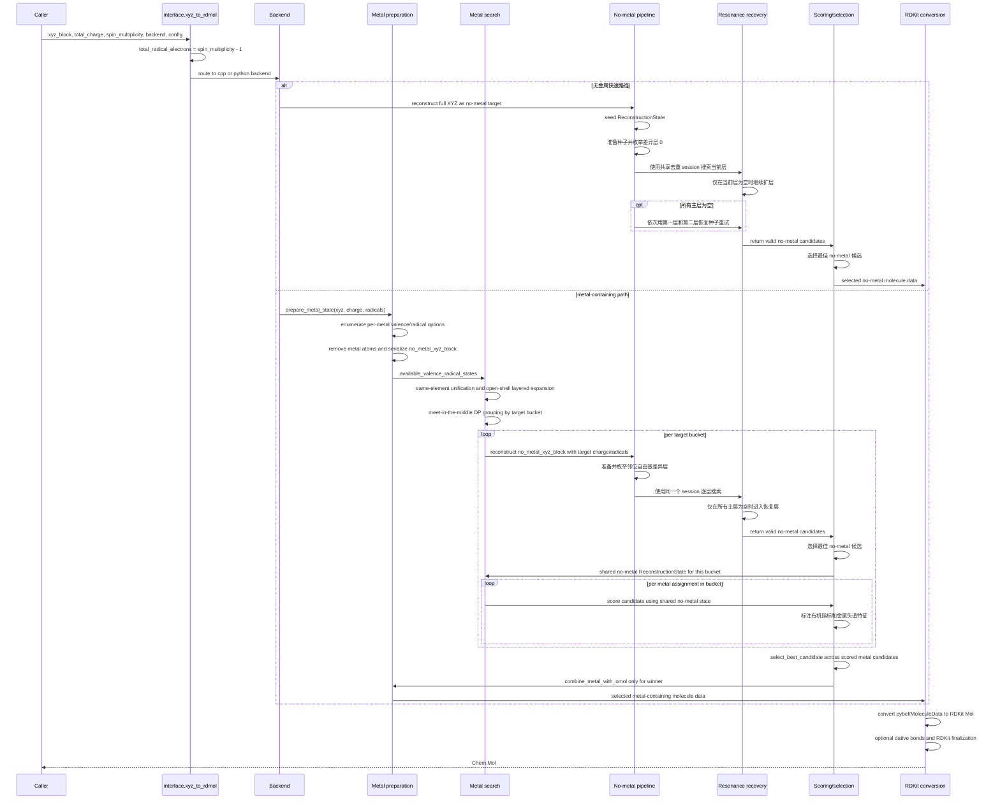

# MolGR 算法架构

[English](ALGORITHM_ARCHITECTURE.md) | [中文](ALGORITHM_ARCHITECTURE.zh-CN.md)

本文描述当前版本的 MolGR 算法架构。范围覆盖
[`src/molgr/interface.py`](../../src/molgr/interface.py) 暴露的
`xyz_to_rdmol(...)`，Python fallback 语义参考实现，以及 C++ `_core` 加速实现。

当前版本的核心状态：

- 默认后端是 `backend="cpp"`，入口仍统一在 `xyz_to_rdmol(...)`。
- Python fallback 是语义参考；C++ 后端复刻同一算法分层，并通过 `MolGRConfig` 接收运行时配置。
- 两个后端最终都回到 RDKit `Chem.Mol`：Python 后端先得到 `pybel.Molecule`，C++ 后端先得到
`MoleculeData`，再由 `molgr.utils.converter` 转成 RDKit。
- 金属体系采用“先重建无金属有机骨架，再选择金属电子态，最后只为赢家回插金属”的统一架构。

## 架构总览

图 1 是面向出版物的紧凑算法总览。图中有意使用抽象节点名称，将端到端数据流、无金属重建
和共振处理细节分开表示。可编辑源文件见
[`ALGORITHM_ARCHITECTURE.drawio`](ALGORITHM_ARCHITECTURE.drawio)。


*图 1. MolGR 端到端分子图重建架构。*

## 术语约定

- `discordance` 统一译为“失谐”，表示候选分子图偏离自然、内部协调电子结构的特征及其累积程度；不译为泛化的“不一致”。
- `harmonicity` 统一译为“和谐度”，表示重建结构的整体协调程度。当前选择流程以较低的失谐惩罚为优先，而不是直接最大化和谐度。

## 统一架构

MolGR 的统一算法可以按七层理解：

1. API 归一化
   - `xyz_to_rdmol(xyz_block, total_charge, spin_multiplicity, backend, config)`
   - 根据 XYZ 元素组成和 `total_charge` 计算总电子数，拒绝奇偶性或数值范围不可能的多重度
   - 将 `spin_multiplicity` 转换成 `total_radical_electrons = spin_multiplicity - 1`
   - 解析配置并路由到 Python 或 C++ 后端

2. 后端执行边界
   - Python：`molgr.fallback.pipeline.reconstruct_with_metals.xyz2omol(...)`
   - C++：`molgr._core.pipeline.reconstruct_with_metals.xyz2omol(...)`
   - C++ pybind 入口释放 GIL，并把 Python `MolGRConfig` 转成 C++ `MolGRConfig`

3. 金属感知编排
   - 读取 XYZ
   - 枚举每个金属原子的候选 `(valence, radical_num)`
   - 删除金属，得到 `no_metal_xyz_block`
   - 把金属态组合压缩成 no-metal 目标桶：`(no_metal_charge_target, no_metal_radical_target)`

4. 无金属重建
   - 从 no-metal XYZ 创建 `ReconstructionState`
   - 运行到邻位自由基处理之前的确定性准备步骤
   - 按电荷分离动作数精确枚举完整局部消除方案
   - 先搜索纯键级层，再逐层引入含电荷分离的种子

5. 共振恢复
   - 按配置的深度和遍历策略搜索每个差异层
   - 对每个原始共振态只执行一次完整 `process_resonance` 归一化
   - 各层共享 raw 状态、遍历标签和 processed 状态去重
   - 首个产生有效候选的层结束后续扩展
   - 验证电荷和自由基数是否满足目标
   - 主池为空时，才依次尝试畸变 pi 键恢复和最终断键恢复
   - 按有机拓扑和力场能量选择 no-metal 赢家

6. 金属候选评分和选择
   - 同一个 no-metal 目标桶只重建一次，然后共享给桶内所有金属态候选
   - 候选先继承共享有机骨架力场分数
   - 选择时依次比较结构金属失谐、有机电子态指标、有机骨架力场分数和 `combination_index`
   - 只为最终赢家执行金属回插

7. RDKit 输出后处理
   - Python 后端：`pybel_to_rdmol(...)`
   - C++ 后端：`mol_data_to_rdkit(...)`
   - 可选执行 `make_dative_bond(...)`
   - 设置隐式氢、芳香性、双键立体、手性和 CIP 标签

关键状态对象：

- `ReconstructionState`：无金属重建状态，包含 `omol`、目标电荷、目标自由基数、阶段历史和评分缓存。
- `MetalPreparationState`：金属剥离后的输入，包含 `no_metal_xyz_block` 和每个金属的候选电子态。
- `MetalCandidateState`：一个金属电子态组合及其诱导的 no-metal 目标桶，可绑定共享的 `ReconstructionState`。
- `MolGRConfig`：统一运行时配置，包含 resonance、metal scoring、metal radical inference 和 C++ 后端开关；force-field 评分固定使用 UFF。

图 1 中的候选分数是单一的有机骨架 UFF 分数。每个通过验证的候选只评估一次，之后由无金属选优
步骤复用。金属态选择还会加入失谐度和电子态一致性判据，并不是再引入一个独立的金属分数。

## 实现视图

下面两类视图用于说明后端路由和调用顺序，是图 1 的实现级补充，不应理解为额外的算法阶段。

### 调用图

```mermaid
flowchart TD
    API["xyz_to_rdmol<br/>src/molgr/interface.py"] --> ValidateSpin["校验总电子数与自旋多重度"]
    ValidateSpin --> Normalize["total_radical_electrons = spin_multiplicity - 1"]
    Normalize --> Backend{"backend"}

    Backend -->|"cpp"| CppEntry["_core.pipeline.reconstruct_with_metals.xyz2omol<br/>pybind: releases GIL"]
    Backend -->|"python"| PyEntry["fallback.xyz2omol"]

    CppEntry --> CppFast{"XYZ definitely metal-free?"}
    CppFast -->|"yes"| CppNoMetal["C++ XyzToOmolNoMetalState"]
    CppFast -->|"no"| CppMetal["C++ Xyz2OmolMolData metal-aware flow"]

    PyEntry --> PyMetal["Python xyz2omol_state metal-aware flow"]

    CppMetal --> Prep["prepare_metal_state / PrepareMetalState"]
    PyMetal --> Prep
    Prep --> MetalOptions["enumerate metal valence/radical states"]
    Prep --> Strip["remove metals -> no_metal_xyz_block"]

    MetalOptions --> SearchGroups["build metal state search groups<br/>same-element unification + open-shell layers"]
    SearchGroups --> DP["group candidates by target via meet-in-the-middle DP"]
    DP --> Buckets["target buckets:<br/>(no_metal_charge_target, no_metal_radical_target)"]

    Buckets --> NoMetal["xyz_to_omol_no_metal_state / XyzToOmolNoMetalState<br/>run once per target bucket"]
    CppNoMetal --> Seed["seed no-metal ReconstructionState"]
    NoMetal --> Seed
    Seed --> Prepare["prepare no-metal seed:<br/>连接与确定性清理"]
    Prepare --> CandidateEnum["枚举精确差异层:<br/>0，然后 1，..."]
    CandidateEnum --> SeedPool["构建当前层共振种子池:<br/>原始态 + 电子态变体"]
    SeedPool --> Resonance["使用共享 session 搜索"]
    Resonance --> Walk["limited-discrepancy radical resonance traversal"]
    Walk --> Process["双路径归一化 + 全局去重 + 验证"]
    Process -->|"为空且仍有主层"| CandidateEnum
    Process -->|"所有主层为空"| Recovery1["第一层恢复: 畸变 pi 键"]
    Recovery1 -->|"仍为空"| Recovery2["第二层恢复: 最终断键"]
    Process --> NoMetalSelect["选择 no-metal 候选"]
    Recovery1 --> NoMetalSelect
    Recovery2 --> NoMetalSelect

    NoMetalSelect --> ScoreMetal["score metal candidates with shared no-metal state"]
    ScoreMetal --> MetalSelect["select_best_candidate"]
    MetalSelect --> Reinsert["combine_metal_with_omol only for winner"]

    Reinsert --> CppMolData["C++ MoleculeData"]
    CppNoMetal --> CppMolData
    PyMetal --> Pybel["pybel.Molecule"]

    CppMolData --> RdkitCpp["mol_data_to_rdkit"]
    Pybel --> RdkitPy["pybel_to_rdmol"]
    RdkitCpp --> Post["make_dative_bond + RDKit stereo/aromaticity finalization"]
    RdkitPy --> Post
    Post --> Out["Chem.Mol"]
```



### 数据流动时序图



## 算法细节

### 无金属准备、种子枚举与恢复层

无金属重建的确定性准备阶段由
[`src/molgr/fallback/utils/no_metals/preparation.py`](../../src/molgr/fallback/utils/no_metals/preparation.py)
和 [`src/cpp/src/utils/no_metals/preparation.cpp`](../../src/cpp/src/utils/no_metals/preparation.cpp)
对齐实现。主要顺序是：

1. `make_connections`
2. `pre_clean`
3. `fresh_omol_charge_radical_initial`
4. 初始化剩余电荷预算：目标总电荷减去当前原子形式电荷
5. 依次执行 NNN、强正电中心、CN 疑难键、羧基、卡宾邻位等消除/清理阶段

确定性准备在邻位自由基处理之前结束。`enumerate_neighbor_radical_seeds(...)`
随后枚举完整的局部动作序列：每一对邻位自由基可以提高键级，也可以按两个方向之一发生
电荷分离。互不相交或彼此重叠的自由基对可以组合出混合策略，不再用一个全局策略控制整条分支。

生产流水线使用精确差异预算调用 `enumerate_neighbor_radical_seeds(...)`：第 0 层只包含提高
键级的消除方案，后续层分别包含一次或多次电荷分离动作。`build_resonance_seed_pool(...)`
为当前层保留原始分叉态，并加入由卡宾自由基迁移产生的非重复变体。只有初始化阶段会全局
推断电子标记；后续每个变换都显式更新受影响原子的电子状态。

所有主层复用同一个共振搜索 session，前一层已经发现的 raw 共振态、Pareto 遍历标签和
processed 状态不会重复计算。首个产生有效候选的层会终止后续扩展；此后也不存在独立的
direct 候选路径。

### 共振恢复策略

共振搜索逐层消费种子，并通过共享 session 在所有已搜索层之间全局去重。当前策略是：

- 构建 resonance state key 和 bond index map。
- 枚举一步自由基共振迁移。
- 使用配置选择 traversal policy：
  - `uff_lite_gain`
  - `input_order`
- 默认使用 limited-discrepancy traversal，限制偏离最高优先级迁移的总 discrepancy。
- 在不同种子之间先按 raw resonance key 全局去重。
- 每个 raw state 只执行一次完整 `process_resonance`，再按 processed key 全局去重。
- 只保留通过 `validate_omol(...)` 的候选。
- 如果没有候选存活，生成第一层畸变 pi 键恢复种子并重新搜索。
- 如果仍为空，生成第二层断键恢复种子并做最后一次搜索。
- no-metal 候选选择优先级是：
  1. 更高芳香稳定性，其次是更多芳香原子
  2. 更大的电荷惩罚后共轭拓扑
  3. 更少的多余自由基标记
  4. 更低 force-field 分数

### 金属搜索与选择

金属路径的关键不是直接枚举所有金属态笛卡尔积，而是先压缩搜索空间。

#### 金属态枚举

对每个 OpenBabel 识别为 metal 的原子：

- 从 `METAL_VALENCE_AVAILABLE_PRIOR` 和 `METAL_VALENCE_AVAILABLE_MINOR` 获取候选价态。
- 使用 `metal_radical_inference` 根据局部配位环境推断可能的金属自由基数。
- 生成 `MetalAtomPosition(idx, symbol, element_idx, valence, radical_num, xyz)`。
- 删除金属原子，生成后续共享的 `no_metal_xyz_block`。

`metal_radical_inference` 是配体场启发式，而不是单一自旋查表：

- 先按元素的 nominal `f/d/s/p` 电子数和候选价态估算氧化后的壳层占据；d-block 金属允许残余 `s/p` 电子并入 d 壳层至多到 `d10`。
- donor 识别使用按元素共价半径计算的距离截止，并受全局 coordination cutoff 上限约束，不再把固定球半径内的所有原子都视为 donor。
- donor 权重按粗粒度光谱化学序列设置：卤素为弱场，O/S 为弱到中等场，N 为中等场，中性膦和碳 donor 为强场；随后按距离加权平均并叠加构型修正。
- 分数低于 `weak_field_threshold - field_ambiguity_margin` 才明确判为 `weak`，高于 `strong_field_threshold + field_ambiguity_margin` 才明确判为 `strong`，中间全部标记为 `ambiguous`。
- 明确弱场只保留高自旋端，明确强场只保留低自旋端，模糊区同时保留两端；分数靠近哪一侧，就把对应自旋分支排在前面。
- square-planar `d8/d7/d9` 仍使用构型特定的低自旋规则。

金属局域未成对电子会优先消耗输入自由基预算，no-metal 目标为 `max(0, 输入自由基数 - 金属局域自由基数)`。当金属局域自旋超过净自旋目标时，允许其表示反平行耦合，不再淘汰该状态，也不会产生负的有机自由基目标。这样既保留通常的预算关系，也能让模糊区的高低自旋分支进入重建。

#### 搜索空间压缩

金属候选组合经过三层压缩：

- same-element multimetal unification：当同元素金属数量超过阈值时，优先把同元素金属统一到共同的 `(valence, radical)` 签名。
- open-shell layered search：开壳层多金属体系按候选价态先验惩罚分层，先尝试更可信的层，只有当前层没有有效候选才进入下一层。
- meet-in-the-middle DP：把金属组拆成左右两半，分别枚举并剪枝 partial assignment，再合并成 no-metal 目标桶。

DP 合并后的 target bucket key 是：

```text
(no_metal_charge_target, no_metal_radical_target)
```

这意味着多个不同金属态组合如果诱导相同的无金属目标，只会触发一次无金属重建。

#### 金属候选评分

每个 `MetalCandidateState` 绑定一个共享的 `ReconstructionState` 后评分。候选选择使用：

- 共享有机骨架 force-field score。
- 由有机电子态指标派生的金属失谐特征：
  - 芳香原子/环数量
    - 芳香环先由 OpenBabel 标记，再额外过滤：如果环上形式电荷之和的绝对值大于等于 4，该环不计入芳香环，也不贡献芳香原子数。
    - 该过滤避免高度电荷分离的环仅因形式上满足 `4n+2` 电子数而被当成芳环。
    - 芳香环和芳香稳定性损失仅保留为诊断 metadata，不计入硬失谐。
  - 共轭原子/键数量
  - 最大共轭连通分量
  - 电荷局域化惩罚
    - 正负原子罚分只有在直接成键的带电原子组内才带相反符号相加；中性原子不能桥接大配体中的远距离电荷。
    - 这样保留局部两性离子/共振电荷抵消，同时避免把远距离电荷错误视为同一个离域抵消单元。
  - 自由基局域化惩罚
- 局部金属配位失谐检查：基于内圈可见性、形式电荷符号、可见双自由基和电荷平衡例外。

#### 金属候选失谐结构特征

失谐结构用于识别错误金属价态候选诱导出的不协调有机-金属组合。算法不会根据失谐结构反向调整当前候选的金属价态，因为金属搜索已经枚举了所有可用价态；正确价态对应的候选应当不会出现这些失谐特征。

当前需要记录的典型失谐结构包括：

1. 内圈可见双自由基原子
   - 原子位于金属内圈配位半径内；配位半径定义为 `metal_access_radius_scale * (中心金属共价半径 + 该原子共价半径) + metal_coordination_extra_tolerance_angstrom`，默认 `metal_access_radius_scale=1.0`，冗余值为 `0.75 Å`。该判据与补配位键共用同一个 helper 和配置，不再额外施加 `3.2 Å` 上限。
   - RDKit 后处理补配位键也使用同样的半径比例和 `metal_coordination_extra_tolerance_angstrom` 距离判据。
   - π 配位键补全还要求两个配位原子到金属中心的距离足够接近；绝对距离差由 `pi_dative_distance_difference_tolerance_angstrom` 限制，默认 `0.10 Å`。
   - 从金属中心到该原子的配位路径可见，未被其它原子遮挡；遮挡半径为 `metal_access_radius_scale * blocker 共价半径 + metal_access_clearance_angstrom`，可见性是独立于内外圈距离判定的第二个维度。
   - 该原子在当前候选中表现为双自由基；`P/S/Cl/Br/I` 的双自由基标记豁免，因为这些元素中间价态下的标记通常对应孤对电子。
   - 典型例子是孤立氧原子。
   - 化学含义：这类结构通常不是合理的中性双自由基配体，而是错误价态候选下未被识别的内圈配位 `O^2-` 型结构。
   - 判定作用：标记当前金属价态候选与局部配位电子结构失谐；不修改该候选的金属价态。

2. 外圈或不可见邻位双电荷
   - 有机部分出现邻位双负电荷或邻位双正电荷。
   - 除非这两个带电原子都属于内圈可见原子，否则该邻位双电荷对记为失谐。
   - 内圈可见原子并非全部豁免：两个相邻同号碳离子（`C-`/`C-` 或 `C+`/`C+`）即使都在内圈且可见，也计为失谐结构；如果两个内圈可见同号碳离子之间存在一个双键共轭桥，例如 `C-–C=C–C-` 或 `C+–C=C–C+`，同样计为失谐结构。
   - 这里的“同号/异号”如果需要进一步分类，是相对于最近中心金属候选价态的符号，而不是相对于 no-metal 目标桶的总电荷状态。
   - 两个邻位同号电荷更像是在错误金属价态预设下被强行分离的 `pi` 电子对，而不是稳定的局部配位或离域结果；内圈相邻或短程共轭的同号碳离子（`C-`/`C-` 或 `C+`/`C+`）常见于金属有机中间体中的 `pi` 电子配位或其逆向电荷分配，不能当成普通孤立配位电荷豁免。
   - 化学含义：这类结构通常说明当前候选把金属-配体整体的二电子分配压到了有机部分，形成补偿性的异常电荷分离。
   - 判定作用：标记当前金属价态候选与有机 `pi` 电子分配失谐；不修改该候选的金属价态。

3. 内圈可见配位原子的排斥性形式电荷
   - 原子位于金属配位半径内；配位半径使用同样的共价半径和加性冗余定义。
   - 从金属中心到该原子的配位路径可见，未被其它原子遮挡。
   - 当当前候选中的金属形式价态非零时，该原子具有非零形式电荷，且形式电荷符号与金属价态符号相同。
   - 当当前候选中的金属形式价态为 0 时，内圈可见原子带正形式电荷也计为该类失谐结构。
   - 豁免局部电荷抵消：如果该原子形式电荷与其相邻非金属原子形式电荷和相加为 0，则不计入该项。
   - 化学含义：可见内圈配位位点通常应当提供与金属价态相容的静电或 donor 支持；非零价金属的同号形式电荷表示局部配位环境与当前金属价态候选相互排斥，零价金属内圈正电则表示候选把缺电子配位中心留在了有机内圈。
   - 判定作用：标记当前金属价态候选与内圈配位静电环境失谐；不修改该候选的金属价态。

4. 全零价金属候选中的有机阳离子
   - 当前候选中所有金属形式价态都为 0，且 no-metal 有机部分存在任意正形式电荷非金属原子时，计为 1 个失谐结构。
   - 该规则不要求正电原子位于内圈或可见；它是候选级全局判据。
   - 豁免两性离子形式：如果有机部分总形式电荷为 0，或该有机阳离子是不饱和阳离子且其相邻非金属原子形式电荷之和加上阳离子电荷为 0，则不计入该失谐。
   - 化学含义：如果所有金属都被设为零价，有机部分残留正电荷通常表示候选没有提供合理的金属-配体电荷分配来源。
   - 判定作用：标记零价金属组合与有机阳离子状态的全局电荷分配失谐。

5. 金属配合物中的欠饱和有机阳离子
   - 只要当前是金属候选，且 no-metal 有机部分存在欠饱和正形式电荷非金属原子时，计为 1 个失谐结构；不区分金属价态正负。
   - 不饱和有机阳离子的判定是：该正电原子按 `外层电子数 - 正电荷 + 总键级` 计算的局部外层电子数低于闭壳层目标（氢为 2，其余为 8）；不使用成键原子数（连接数）和总键级的比较，避免把 `O(v3)+` 的单个三键误判为欠饱和。这包括欠价的鎓离子型阳离子。
   - 豁免两性离子形式：如果有机部分总形式电荷为 0，或该不饱和阳离子的相邻非金属原子形式电荷之和加上阳离子电荷为 0，则不计入该失谐。
   - 化学含义：欠饱和阳离子是可接受金属电子转移的伪阳离子中心；即使金属为负价，也可能把电子从金属转移到该中心，因此不能因金属负价而豁免。
   - 判定作用：标记金属-有机电子转移分配失谐。

6. 缺少电荷平衡来源的负价金属
   - 当前候选中每个负形式价态金属默认贡献 `0.5` 失谐分。
   - 例外一：no-metal 结构中存在外圈 `H+`，即带正电的氢原子不在任何当前金属候选的内圈配位半径内；其它外圈有机阳离子不再豁免负价金属。
   - 例外二：当前候选中同时存在其它正价金属；此时可解释为金属阳离子对负价金属中心的电荷平衡，允许负价金属候选。
   - 化学含义：孤立负价金属在绝大多数普通候选中不合理，除非体系中有明确的外圈质子酸或金属阳离子提供整体电荷平衡。
   - 判定作用：标记当前金属价态候选的全局电荷平衡失谐；不直接删除该候选。

7. 构造重复片段的净电荷不对称
   - 按元素和连接关系对断开的有机片段分组；该签名有意忽略形式电荷和键级。
   - 同一重复片段组中成员的净形式电荷不一致时，该组贡献 1 个失谐计数。
   - 该特征识别把等价配体片段强行分配成彼此失谐的氧化/还原态候选。

8. 内圈可见多齿碳环配体中的还原型断裂 `pi` 模式
   - 必须是具体的五元或六元全碳环，且同一个金属中心通过内圈可见性判据至少看见该环的 3 个碳原子。
   - 完整芳香或 Kekulé `pi` 模式不计入：包括六元环 3 条交替双键，以及五元负碳环 2 条非相邻双键。
   - 排除这些完整 `pi` 环后，该可见多齿碳环中的每个负形式电荷碳贡献 1 个失谐计数。
   - 该特征针对错误金属价态候选把多齿碳环配体还原并破坏其离域 `pi` 形式；这是环局部结构失谐，不是全局芳香性奖励。

9. 强配位几何失谐
    - 平面四方配位的 Pd/Pt 若形式价态不低于 IV，贡献 1 个失谐计数。
    - 线性配位的 Ag/Au 若形式价态不低于 III，贡献 1 个失谐计数。
    - 当前只处理这两类强几何/氧化态矛盾；其它几何不作硬判定。

最终选择显式区分不同特征层：

- 对每个金属候选先绑定共享 no-metal state，计算有机骨架 force-field score。
- `metal_discordance_structural_count` 是结构失谐之和，包括负价金属的分数型惩罚。
- `metal_discordance_count` 与结构失谐总数相同；芳香性损失和金属价态列表归属均不包含在内。
- 先比较 `metal_discordance_count`，只保留失谐分最低的候选。
- 如果多个候选并列，先依次比较最大共轭分量、共轭原子数和共轭键数的缺口。
- 然后选择芳香原子覆盖缺口更小、再到芳香环缺口更小的候选。
   - 如果覆盖指标也并列，再比较芳香稳定性缺口。
   - 如果芳香性指标也并列，先选择有机自由基局域化罚分更小的候选。
   - 对此前所有字段均相同的候选，以组内最低有机电荷局域化罚分为基准；只有差值大于等于
     `metal_scoring.charge_localization_selection_margin` 时，电荷局域化才参与判定。margin
     内视为并列，继续比较 force-field score；默认 margin 为 `0.3`。
   - 只有上述结构和电子态评分全部并列时，才比较有机骨架 force-field score；配置中的金属价态列表顺序不是化学评分。
   - 所有化学评分都并列时，再按 `combination_index` 做稳定的确定性打破平局。
- 金属候选记录的 `selection_key` 顺序为：
  `(metal_discordance_count, max_conjugated_component_deficit,
  conjugated_atom_deficit, conjugated_bond_deficit, aromatic_atom_deficit,
  aromatic_ring_deficit, aromatic_stability_deficit,
  radical_localization_penalty, charge_localization_margin_exceeded,
  force_field_score, combination_index)`。
- 入选候选仍会记录用于派生失谐度的有机电子态指标；已移除的金属环境评分指标不再存在于运行时 metadata。

## 实现与验证

### C++ 后端已实现的额外优化

C++ 后端是 Python fallback 语义的加速实现。下面这些优化可以改变调度、缓存和线程安全实现
细节，但同一个 `MolGRConfig` 下不得改变候选集合、候选顺序、评分 key、平局打破逻辑或最终
入选分子。

1. 无金属输入快路径
   - `XyzBlockIsDefinitelyMetalFree(...)` 只扫描 XYZ atom symbol。
   - 如果确认无金属，直接进入 `XyzToOmolNoMetalState(...)`，跳过金属剥离和金属态搜索。

2. GIL 释放
   - pybind 入口在调用 C++ pipeline 时释放 Python GIL。
   - 长时间运行的重建、搜索和 force-field 计算不会阻塞其他 Python 线程。

3. 目标桶并行
   - `enable_target_bucket_parallelism` 默认开启。
   - `target_bucket_parallel_threshold` 默认为 `1`。
   - `target_bucket_parallel_max_threads=None` 表示 C++ 按硬件线程数、target bucket 数量以及
     已设置的 `cpp_backend.max_threads` 全局上限自动确定 worker 数。
   - 每个 no-metal target bucket 独立重建，可通过 `ParallelForIndices(...)` 并行执行。
   - 桶内 worker 复用同一个 no-metal XYZ seed molecule 的 clone，不再重复解析同一个
     XYZ block。

4. DP frontier 并行
   - C++ `GroupCandidatesByTargetDp(...)` 在目标桶并行开启且左右 frontier 都非空时，用 `std::async` 并行构建一侧 partial assignment frontier。
   - 这加速了多金属体系的 meet-in-the-middle 前半段。

5. 候选评分并行
   - `enable_candidate_scoring_parallelism` 已接入，但默认关闭。
   - 当开启且候选数达到 `candidate_score_parallel_threshold` 时，桶内金属候选评分可并行执行。

6. no-metal score bundle 预热
   - C++ `ReconstructionState::PreheatScoreBundle(...)` 会一次性准备：
     - force-field score key
     - 有机骨架 force-field 分数
     - post-reinsertion base components
     - 固定 UFF force-field 元数据
   - 金属桶内多个候选共享同一个 no-metal state 时，可以避免重复构建这些派生数据。
   - `enable_target_bucket_score_bundle_preheat` 默认开启，可单独关闭以排查行为差异。

7. 全局 force-field evaluation LRU
   - `ForceFieldEvaluationCache` 使用线程安全 LRU，key 对应固定 UFF 结构评分。
   - 相同结构重复评分时可直接复用 `ForceFieldEvaluation`。

8. MolGR vendor UFF force-field
   - C++ 固定使用 MolGR 维护的线程安全 `MolgrForceFieldUFF` vendor 子模块进行 UFF 评分，不再调用 OpenBabel 进程全局 force-field 插件。
   - 这样可以移除 `OBForceField::FindForceField("uff")` 的 Setup/Energy 全局锁，同时保持与 Python fallback 相同的固定 UFF 评分策略。
   - `enable_uff_atom_typing_cache` 是可选 C++ 加速项，默认关闭。

9. thread-local vendor UFF 实例复用
   - 每个线程维护可复用的 force-field 实例。
   - C++ 使用 exact setup key 和 OpenBabel setup key 判断何时需要重置实例，避免 OpenBabel 粗粒度 setup 判断遗漏图/电荷变化。

10. C++ state copy-on-write
    - `OmolStateMachine` 使用 `shared_ptr<OBMol>`。
    - 分支时如果没有替换 molecule，会共享对象和缓存；真正修改时通过 `EnsureUniqueMol()` 复制。
    - 共振分支和候选状态传递减少了不必要的 OBMol 拷贝。

11. MolGR vendor XYZ seed perception
    - C++ 解析 XYZ seed 时统一使用 `molgr::utils::ReadXyzBlockToMol(...)` 和
      `molgr::vendor::openbabel_threading::ConnectTheDotsAndPerceiveBondOrders(...)`。
    - 这个 helper 只 vendor MolGR XYZ seed 路径需要的 OpenBabel bond connectivity
      和 bond-order perception 逻辑，不再用进程级全局锁包住
      `OBMol::ConnectTheDots()` / `OBMol::PerceiveBondOrders()`。
    - C++ 代码不要直接调用这两个 OpenBabel 方法；直接调用会重新串行化目标桶 worker，
      也会让 C++ 后端偏离 Python fallback 的原样加速实现。

12. C++ 输出 `MoleculeData`
    - C++ 后端返回轻量 `MoleculeData`，Python 层再转 RDKit。
    - 避免把 OpenBabel/Pybel 对象作为主要跨语言结果传递。

13. 运行时性能计时
    - C++ pipeline 有 `RunTimingReducer`，记录 no-metal pipeline、resonance、metal enumeration、force-field key/setup/energy 等耗时。
    - 这不是选择语义的一部分，但用于定位 C++ 加速路径中的热点。

实现状态说明：

- resonance candidate parallelism 的调度成本高于收益，当前版本不再保留对应 C++ 配置项。
- `SearchResonanceCandidates(...)` 仍按串行流程准备 resonance candidates。

### C++/Python 后端一致性护栏

Python fallback 是语义参考。C++ 后端可以缓存、并行、预计算，或使用线程安全 vendor
子模块，但这些优化必须保持相同 `MolGRConfig` 下的候选集合、候选顺序、评分 key 和最终
入选分子与 Python fallback 一致。

下面是已经踩过的行为分叉点，后续修改不能重新引入：

1. SMARTS 匹配语义
   - C++ 中所有 SMARTS 调用必须通过 `molgr::smarts::FindAll(...)`。
   - `FindAll(...)` 有意复刻 `pybel.Smarts.findall()`：调用
     `OBSmartsPattern::Match(mol)` 后返回 `GetUMapList()`。
   - 除 SMARTS helper 内部外，不要直接使用 `OBSmartsPattern::Match(...)`、
     `GetMapList()` 或更底层的 OpenBabel match-list helper。

2. force-field setup 状态
   - OpenBabel UFF force-field 实例是有状态对象，会复用 setup 数据。
   - 两端都必须维护 exact setup key 和 OpenBabel 粗粒度 setup key；当 exact key
     改变但粗粒度 key 未变时，必须先 reset force field，再执行 `Setup(...)`。
   - 清空 force-field cache 时，也必须同步清空 setup-state 记录。
   - vendor UFF 和 atom typing cache 必须保留同样的 reset 语义。

3. no-metal 共振候选选择
   - C++ 必须使用与 Python 相同的一次性完整 selection key：
     `(-aromatic_atom_count, -aromatic_ring_count, -aromatic_stability,
     -adjusted_max_conjugated_component_size,
     -adjusted_conjugated_atom_count, -adjusted_conjugated_bond_count, score)`。
   - 不要重新引入“先按 topology 过滤，再只给并列者做 UFF scoring”的路径；中间候选
     摘要也必须与 Python 对齐，而不仅是最终化学等价。

4. `clean_resonances_8`
   - C++ 条件必须匹配 Python。该规则只由 bond-order pattern 触发；额外的 atom
     charge 检查会改变行为。
   - aromatic perception reset 必须使用线程安全 OpenBabel helper。

5. elimination 规则中的元素常量
   - 数字 atomic-number 列表必须和 Python 常量保持一致。
   - iodine 是 `53`；避免再次出现误写成 `56` 这类手写常量漂移。

6. 线程并行和 C++ 专属加速项
   - `enable_target_bucket_parallelism` 等 C++ 专属选项只能改变调度和性能，不能改变结果
     顺序、平局打破逻辑或入选候选。
   - 任何可能影响候选构造、过滤、score 复用、OpenBabel perception 或 force-field setup
     的优化，启用前都必须有 parity 测试兜住。

7. C++ XYZ seed perception
   - C++ 不能直接调用 `OBMol::ConnectTheDots()` 或 `OBMol::PerceiveBondOrders()`。
     C++ XYZ seed 唯一允许入口是 `ReadXyzBlockToMol(...)`，内部使用 MolGR vendor helper。
   - 重新引入包住 OpenBabel 原生方法的全局 perception lock 会破坏目标桶并行，也会让
     C++ 后端变成另一套实现策略，而不是 Python fallback 的原样加速实现。

这些边界的最小验证命令：

```bash
uv run pytest \
  tests/test_cpp_python_metal_candidate_parity.py \
  tests/test_cpp_uff_atom_typing_cache.py \
  tests/test_force_field_scoring_policy.py \
  tests/test_fallback_scoring_cache.py -q

uv run ruff check \
  tests/test_cpp_python_metal_candidate_parity.py \
  tests/test_force_field_scoring_policy.py
```

验证 tmQMg 后端对齐时，只比较 MolGR C++ 和 fallback 两个方法：

```bash
bash scripts/benchmark_env.sh run python benchmarks/tmqmg_xyz_benchmark/run.py \
  --csv /mnt/e/download/tmQMg_properties_and_targets.csv \
  --xyz-dir /mnt/e/download/tmQMg_xyz/xyz \
  --limit 1000 \
  --out benchmarks/_runs/<run-name> \
  --progress-every 50 \
  --case-timeout-seconds 1.0 \
  --cpp-accelerations all \
  --methods molgr_cpp,molgr_fallback \
  --process-workers 1
```

只有在测吞吐时才增加 `--process-workers`。进程级并行会与 C++ target-bucket 线程叠加，
过高 worker 数会竞争同一批 CPU 资源。

### 维护边界

修改算法时应按以下边界验证：

- 修改 fallback 语义：需要确认 C++ parity，尤其是 [`tests/`](../../tests/) 中的
  `test_cpp_*` 或相关后端回归测试。
- 修改 C++ pipeline、bindings 或 `_core` 暴露面：先重建扩展，再运行受影响测试。
- 修改 `_core` surface：同步生成 `.pyi` stub。
- 修改 force-field、resonance、metal scoring 配置：同时检查 Python dataclass、C++ config struct、`FromPython(...)` 和绑定导出。
- 修改金属搜索：重点检查 target bucket 复用、DP 剪枝、same-element unification 和 open-shell layered search 的行为是否仍一致。
